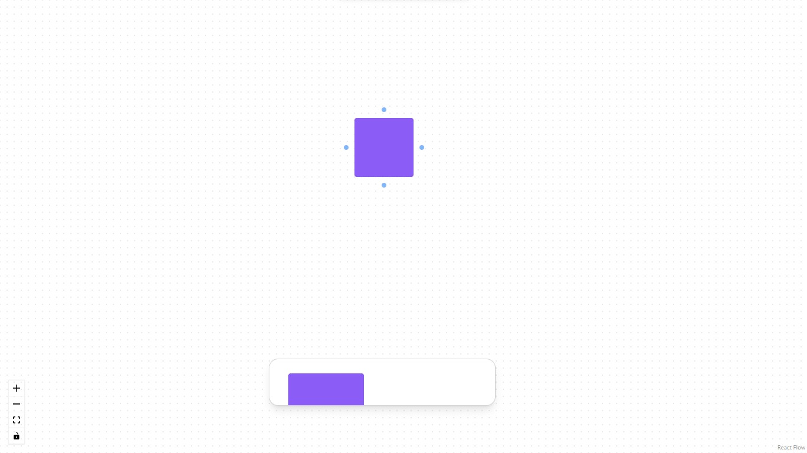
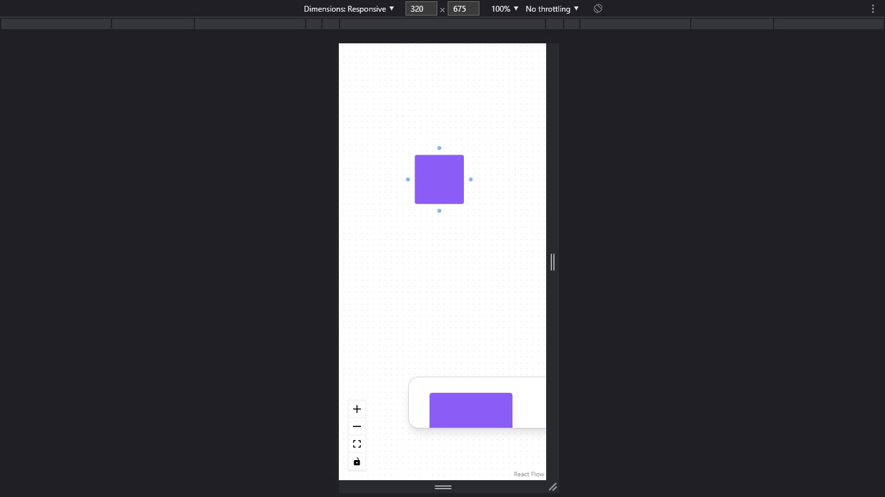

## UI-FigJam

Interface de usuário do FigJam desenvolvida com a lib "React-Flow".

## Ferramentas 📌

HTML | CSS | TypeScript | ReactJS

### Para rodar na sua máquina

> É necessário o NodeJS instalado...

**PASSO 1 - clonar o repositório**

> No github, vá até o botão `<> CODE`
> E escolha uma das opções pra clonar o repositório para sua máquina

**PASSO 2 - instalar as dependencias do Node**

> Com o repositório na sua máquina
> insira no terminal: `npm install` para instalar as dependências do Node

**PASSO 3 - rodar aplicação**

> Com as dependências instaladas, insira no terminal `npm run dev` e clique na URL que foi retornada